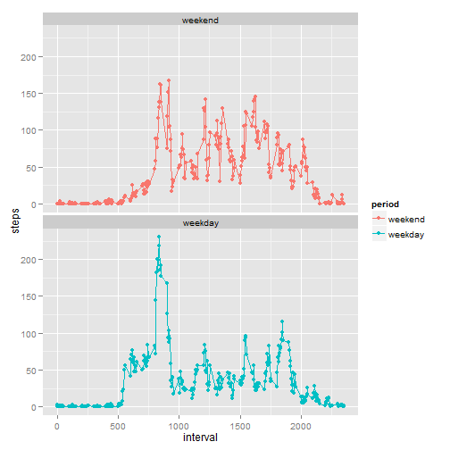
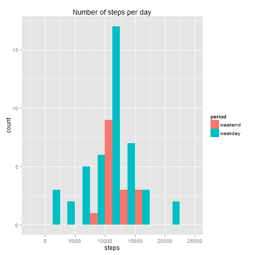

# Reproducible Research: Peer Assessment 1

## Loading and preprocessing the data

The code below to read the data is pretty straightforward.  Two points though: In addition to identify the strings `NA` as missing data, we initially set the elements of `date` as strings.


```r
data.csv <- 'activity.csv'

data <- read.csv(file = data.csv,
	header = TRUE,
	col.names = c('steps', 'date', 'interval'),
	na.strings = 'NA',
	colClasses = c('numeric', 'character', 'numeric'))
```

Let's have a cursory look at the data:


```r
str(data)
```

```
## 'data.frame':	17568 obs. of  3 variables:
##  $ steps   : num  NA NA NA NA NA NA NA NA NA NA ...
##  $ date    : chr  "2012-10-01" "2012-10-01" "2012-10-01" "2012-10-01" ...
##  $ interval: num  0 5 10 15 20 25 30 35 40 45 ...
```

All looks good. First, we now process `date` to really represent dates and not just strings using the `lubridate` package.


```r
library(lubridate)

data <- data %>%
	mutate(date = ymd(date, tz = 'UTC'))
```

Let's now look at the missing data:


```r
sum(!complete.cases(data))
```

```
## [1] 2304
```

```r
library(dplyr)

data.missing.summary <- data %>%
	summarize(
		steps = sum(is.na(steps)),
		date = sum(is.na(date)),
		time = sum(is.na(interval)))

data.missing.summary
```

```
##   steps date time
## 1  2304    0    0
```

We can see that out of **17568** observations, **2304** have missing data in them.  Investigating further, only the `steps` variable is affected; the `date` and `time` variable are all complete.


```r
incomplete.data <- data %>%
		filter(is.na(steps))

data <- data %>%
		filter(!is.na(steps))
```

A word on the 5-minute interval:


```r
data.summary.interval <- data %>%
	summarize(min = min(interval),
		max = max(interval))

data.summary.interval
```

```
##   min  max
## 1   0 2355
```

We expected the number of 5-minute intervals to be **24 hours * 60 minutes/hour / 5 minutes = 720**.  We got instead **2356** `max - min + 1` and we don't know why...  In a real-world situation, we would want to fully understand what this variable represents before going further.

## What is mean total number of steps taken per day?

Since we need to return the number of steps grouped by day multiple times in this assigment, we are creating a function for that.


```r
day.data <- function(data) {
	return (data %>%
		group_by(date) %>%
		arrange(date) %>%
		summarize(steps = sum(steps)))
}

steps.day.data <- day.data(data)
```

We can verify that, indeed, days have been collapsed into unique rows.


```r
head(steps.day.data, n = 10)
```

```
## Source: local data frame [10 x 2]
## 
##          date steps
## 1  2012-10-02   126
## 2  2012-10-03 11352
## 3  2012-10-04 12116
## 4  2012-10-05 13294
## 5  2012-10-06 15420
## 6  2012-10-07 11015
## 7  2012-10-09 12811
## 8  2012-10-10  9900
## 9  2012-10-11 10304
## 10 2012-10-12 17382
```

Let's now compute the mean and median for these days:


```r
steps.day.summary <- steps.day.data %>%
	summarize(mean = mean(steps),
		median = median(steps))

steps.day.summary
```

```
## Source: local data frame [1 x 2]
## 
##       mean median
## 1 10766.19  10765
```

Or more nicely, the mean and median total number of steps taken per day are:

| Variable | Value |
|:---|---:|
| Mean total number of steps taken per day | **10766.19** |
| Median total number of steps taken per day | **10765** |

Finally, the histogram of the total number of steps taken each day is below:


```r
library(ggplot2)

binwidth <- 2500

ggplot(steps.day.data, aes(x = steps)) +
	geom_histogram(binwidth = binwidth) +
	ggtitle(label = 'Number of steps per day (without imputed data)') +
	geom_vline(aes(xintercept = steps.day.summary$mean),
		color = 'red')
```

 

## What is the average daily activity pattern?

The code to compute the average daily activity (the 5-minute interval versus the average number of steps taken, averaged across all days) and draw the corresponding time series is shown below:


```r
interval.data <- function(data) {
	return (data %>%
		group_by(interval) %>%
		arrange(interval) %>%
		summarize(steps = mean(steps)))
}

steps.interval.data <- interval.data(data)

head(steps.interval.data, n = 10)
```

```
## Source: local data frame [10 x 2]
## 
##    interval     steps
## 1         0 1.7169811
## 2         5 0.3396226
## 3        10 0.1320755
## 4        15 0.1509434
## 5        20 0.0754717
## 6        25 2.0943396
## 7        30 0.5283019
## 8        35 0.8679245
## 9        40 0.0000000
## 10       45 1.4716981
```

```r
qplot(x = interval, y = steps, data = steps.interval.data) +
	geom_line() +
	ggtitle(label = 'Average daily activity pattern')
```

 


```r
steps.interval.summary <- data %>%
	summarize(max = max(steps))

steps.interval.summary
```

```
##   max
## 1 806
```

| Variable | Value |
|:---|---:|
| 5-minute interval, which on average across all the days in the dataset, contains the maximum number of steps | **806** |

## Imputing missing values

As we reported in the `loading and preprocessing the data` section, we have

| Variable | Value |
|:---|---:|
| Total number of missing values in the dataset | **2304** |

Our strategy for filling in all of the missing values in the dataset is to simply use the mean for that 5-minute interval across all days.


```r
steps.interval.mean <- function(interval_with_missing_steps) {
	as.numeric(subset(x = steps.interval.data, subset = (interval == interval_with_missing_steps), steps))
}

steps.intervals.mean <- function(intervals_with_missing_steps) {
	sapply(intervals_with_missing_steps, steps.interval.mean)
}

imputed.data <- incomplete.data %>%
	mutate(steps = steps.intervals.mean(interval))
```

The imputed data looks good and is all filled in...


```r
head(imputed.data, n = 10)
```

```
##        steps       date interval
## 1  1.7169811 2012-10-01        0
## 2  0.3396226 2012-10-01        5
## 3  0.1320755 2012-10-01       10
## 4  0.1509434 2012-10-01       15
## 5  0.0754717 2012-10-01       20
## 6  2.0943396 2012-10-01       25
## 7  0.5283019 2012-10-01       30
## 8  0.8679245 2012-10-01       35
## 9  0.0000000 2012-10-01       40
## 10 1.4716981 2012-10-01       45
```

```r
sum(!complete.cases(imputed.data))
```

```
## [1] 0
```

With these imputed observations, the updated histogram of the total number of steps taken each day is even more concentrated around the mean total number of steps taken per day are.  This is expected.


```r
steps.day.data <- merge(day.data(data) %>% mutate(origin = 0),
	day.data(imputed.data) %>% mutate(origin = 1),
	all = TRUE) %>%
	mutate(origin = factor(origin,
		levels = c(0, 1),
		labels = c('collected', 'imputed')))

ggplot(steps.day.data, aes(x = steps, fill = origin)) +
	geom_histogram(binwidth = binwidth) +
	ggtitle(label = 'Number of steps per day (with imputed data)')
```

 

Let's merge the collected and imputed data to create the same histogram and statistics as in the `What is mean total number of steps taken per day?` section.


```r
data <- merge(data,
	imputed.data,
	all = TRUE)

steps.day.data <- day.data(data)

ggplot(steps.day.data, aes(x = steps)) +
	geom_histogram(binwidth = binwidth) +
	ggtitle(label = 'Number of steps per day per day (with imputed data)') +
	geom_vline(aes(xintercept = steps.day.summary$mean),
		color = 'red')
```

 

```r
steps.day.new_summary <- steps.day.data %>%
	summarize(mean = mean(steps),
		median = median(steps))

steps.day.new_summary
```

```
## Source: local data frame [1 x 2]
## 
##       mean   median
## 1 10766.19 10766.19
```

The mean and median total number of steps taken per day then become:

| Variable | Without imputed data | With imputed data |
|:---|---:|---:|
| Mean total number of steps taken per day | **10766.19** | **10766.19** |
| Median total number of steps taken per day | **10765** | **10766.19** |

**There is no change for mean and a modest change for the median.  This expected as with of imputing missing data based on the 5-minute mean interval, the distribution is now even more concentrated around its mean.**

## Are there differences in activity patterns between weekdays and weekends?

### Daily activity pattern

The code to create and chart the time series of the 5-minute interval against the average number of steps taken, averaged across all weekday days or weekend days introduces a new factor variable `period` with levels `weekend` and `weekday`.


```r
is.weekday <- function(date) {
	return (ifelse(wday(date, label = TRUE) %in% c('Sat', 'Sun'), FALSE, TRUE))
}

steps.interval.weekday.data <- merge(interval.data(data %>% filter(!is.weekday(date))) %>% mutate(period = 0),
	interval.data(data %>% filter(is.weekday(date))) %>% mutate(period = 1),
	all = TRUE) %>%
	mutate(period = factor(period, levels = c(0, 1), labels = c('weekend', 'weekday')))

head(steps.interval.weekday.data, n = 10)
```

```
##    interval       steps  period
## 1         0 0.214622642 weekend
## 2         0 2.251153040 weekday
## 3         5 0.042452830 weekend
## 4         5 0.445283019 weekday
## 5        10 0.016509434 weekend
## 6        10 0.173165618 weekday
## 7        15 0.018867925 weekend
## 8        15 0.197903564 weekday
## 9        20 0.009433962 weekend
## 10       20 0.098951782 weekday
```

```r
qplot(x = interval,
	y = steps,
	data = steps.interval.weekday.data,
	color = period) +
	geom_line() +
	facet_wrap(~ period, nrow = 2, ncol = 1)
```

 

The plot shows higher activity in mornings during weekdays while weekends have steady activity throughout the day.

### Bonus: Daily number of steps between weekdays and weekends

Not part of the assignment.  More like exploratory research.  The histogram seems to contradict the previous section that on average people are more active on the weekend.  This is still true.  Here, we plot the `total` daily activity and the weighting is 5 weekdays for only 2 weekend days.


```r
steps.day.weekday.data <- merge(day.data(data %>% filter(!is.weekday(date))) %>% mutate(period = 0),
	day.data(data %>% filter(is.weekday(date))) %>% mutate(period = 1),
	all = TRUE) %>%
	arrange(steps, date, period) %>%
	mutate(period = factor(period, levels = c(0, 1), labels = c('weekend', 'weekday')))

head(steps.day.weekday.data, n = 10)
```

```
##          date steps  period
## 1  2012-11-15    41 weekday
## 2  2012-10-02   126 weekday
## 3  2012-10-25  2492 weekday
## 4  2012-11-08  3219 weekday
## 5  2012-11-20  4472 weekday
## 6  2012-10-29  5018 weekday
## 7  2012-11-16  5441 weekday
## 8  2012-10-26  6778 weekday
## 9  2012-11-29  7047 weekday
## 10 2012-11-13  7336 weekday
```

```r
ggplot(steps.day.weekday.data, aes(x = steps, fill = period)) +
	geom_histogram(position = 'dodge', binwidth = binwidth) +
	ggtitle(label = 'Number of steps per day')
```

 

